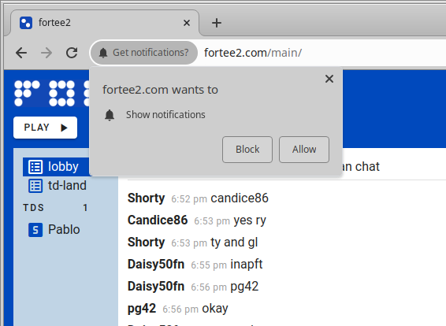

# 5.22.1 - 11/02/2023

## Notifications

This release added browser notifications when your table is ready. Now, the **first time you sign up for a tournament** your browser will prompt you whether you will allow fortee2.com to show you notifications. Here is an example for Chrome:

    

If you allow them, fortee2.com will pop up a **browser notification** whenever your table is ready. This may help get your attention.

### Unblocking

If you **block** notifications but want to turn them back on later, go to your browser settings and look for "notifications" or "site settings". You should see fortee2.com listed and be able to switch it back to **allow**.
